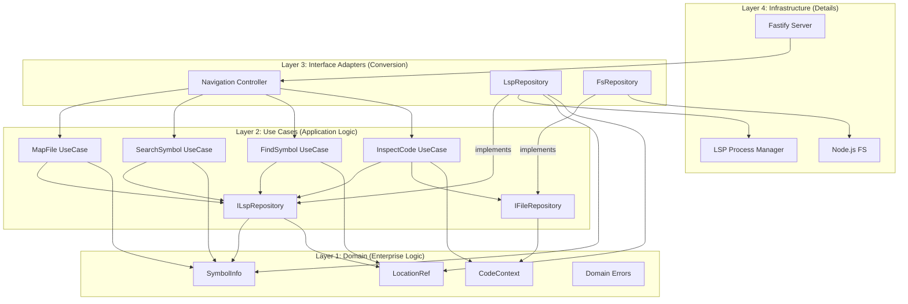
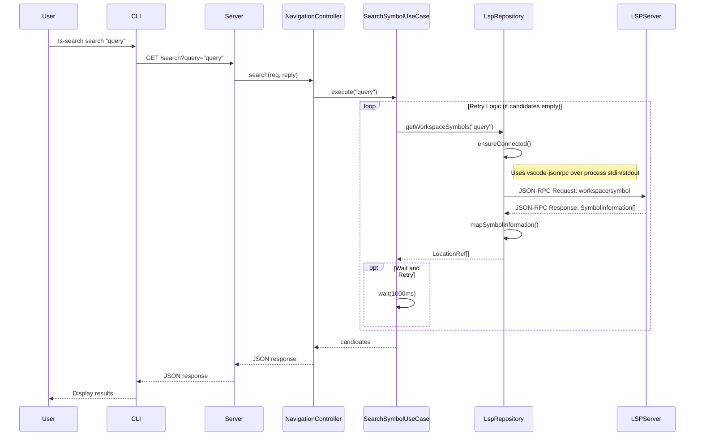

# Agent Code Navigator - Clean Architecture Design Doc

## 1. Architectural Overview

本プロジェクトは **Clean Architecture (Onion Architecture)** を採用し、関心事の分離と依存関係の逆転（DIP: Dependency Inversion Principle）を徹底する。
LSP という「外部の巨大で不安定な詳細」から、エージェントのための「純粋なビジネスロジック」を守ることを主目的とする。

### The Dependency Rule

依存の方向は常に **外側（詳細）から内側（抽象）** へ向かう。内側の円（Domain/UseCase）は、外側の円（Web/LSP）について何も知ってはならない。

- **Domain (Entities):** 企業全体の最重要ビジネスルール。外部依存ゼロ。
- **UseCases (Interactors):** アプリケーション固有のビジネスルール。
- **Interface Adapters:** データを UseCase や Entity に便利な形式と、Web や LSP に便利な形式の間で変換する。
- **Infrastructure:** フレームワーク、ドライバ、ツール（LSP プロセス、HTTP サーバー）。



## 2. Layer Definitions & Responsibilities

### 2.1. Domain Layer (Layer 1)

- **責務:** エージェントが理解すべき「コードの概念」とルールを定義する。
- **制約:** 外部ライブラリ（vscode-languageserver-types など）を import してはならない。純粋な TypeScript の型のみ。

**Entities:**

- `LocationRef`: コードの物理的位置を示す識別子。
- `CodeContext`: エージェントに提示するコード断片と関連情報。
- `SymbolInfo`: コード構造のアウトライン情報。

**Errors:**

- `SymbolNotFoundError`: 指定されたシンボルが存在しない。
- `AmbiguousSymbolError`: 複数の候補が見つかった。

### 2.2. UseCase Layer (Layer 2)

- **責務:** アプリケーション固有の操作フロー。
  「LSP クライアントを起動する」といった技術的詳細は知らず、「シンボルを探す」という目的のみを記述する。

**Ports (Interfaces):**

- `ILspRepository`: 外界（LSP）から情報を取得するための抽象インターフェイス。

**Interactors:**

- `MapFileUseCase`: ファイルパスを受け取り、シンボルツリーをフラット化して返す。
- `SearchSymbolUseCase`: クエリを受け取り、ワークスペース内のシンボルを検索して返す。
- `FindSymbolUseCase`: ID を受け取り、その定義と参照箇所（References）を返す。
- `InspectCodeUseCase`: ID を受け取り、AST 範囲に基づいたスマートなブロック抽出を行う。

### 2.3. Interface Adapters Layer (Layer 3)

- **責務:** 外部形式と内部形式の変換（Translation）。

**Controllers:**

- HTTP リクエスト（JSON）を受け取り、UseCase の入力 DTO に変換して実行する。
- UseCase の戻り値やエラーを、HTTP レスポンス（ステータスコード付き）に変換する。

**Gateways (LspRepository):**

- 最重要コンポーネント。 `ILspRepository` の実装クラス。
- JSON-RPC の非同期通信をハンドリングする。
- LSP の Location (URI + Range) を Domain の `LocationRef` (FilePath + Line) に変換する。
- LSP 特有のエラー（サーバーダウン、タイムアウト）をキャッチし、Domain Error または System Error に変換して投げる。

### 2.4. Infrastructure Layer (Layer 4)

- **責務:** 実際に動くメカニズム。

**Components:**

- **Web Framework:** Fastify/Express の設定、ルーティング定義。
- **Process Manager:** typescript-language-server の起動、再起動、停止、標準入出力のパイプ管理。
- **Main:** アプリケーションの組立工場（Composition Root）。

## 3. Sequence Diagram



## 4. Implementation Details

### 4.1. Directory Structure

```
src/
├── domain/                 # Layer 1: Entities
│   ├── entities.ts         # LocationRef, CodeContext
│   └── errors.ts           # Domain specific errors
│
├── usecases/               # Layer 2: Business Rules
│   ├── ports/              # Repository Interfaces
│   │   ├── ILspRepository.ts
│   │   └── IFileRepository.ts
│   ├── MapFileUseCase.ts
│   ├── FindSymbolUseCase.ts
│   ├── SearchSymbolUseCase.ts
│   └── InspectCodeUseCase.ts
│
├── adapters/               # Layer 3: Adapters
│   ├── controllers/
│   │   └── NavigationController.ts
│   ├── gateways/
│   │   ├── LspRepository.ts # Implements ILspRepository
│   │   ├── FsRepository.ts  # Implements IFileRepository
│   │   └── converters.ts    # LSP types <-> Domain types
│   └── presenters/          # (Optional) Response formatting
│
├── infrastructure/         # Layer 4: Frameworks & Drivers
│   ├── server/             # HTTP Server setup
│   ├── lsp/                # Process Manager (spawn, IPC)
│   └── di/                 # Manual DI setup
│
└── main.ts                 # Entry point (Composition Root)
```

### 4.2. Error Handling Strategy

例外は境界（Boundary）を越えるたびに翻訳されなければならない。

1.  **Infrastructure (LSP Crash):** `LspRepository` がキャッチし、`RepositoryError` として再スロー。
2.  **UseCase:** `RepositoryError` はそのまま上位へ。論理エラー（見つからない等）は `DomainError` (`SymbolNotFoundError`) をスロー。
3.  **Controller:** すべての例外をキャッチ。

**Mapping:**

- `SymbolNotFoundError` -> 404 Not Found
- `AmbiguousSymbolError` -> 300 Multiple Choices
- その他 -> 500 Internal Server Error

### 4.3. Dependency Injection (Manual Wiring)

複雑な DI コンテナは避け、`main.ts` で明示的に依存関係を注入する。これにより構成が一目でわかる。

```typescript
// main.ts
async function bootstrap() {
  // 1. Infrastructure (Drivers)
  const lspProcess = new LspProcessManager();
  // await lspProcess.start(); // (Optional: handled in LspRepository.initialize)

  // 2. Adapters (Interface Adapters)
  const lspRepo = new LspRepository(lspProcess);
  const fsRepo = new FsRepository();

  await lspRepo.initialize();

  // 3. UseCases (Application Business Rules)
  const mapFileUC = new MapFileUseCase(lspRepo);
  const findSymbolUC = new FindSymbolUseCase(lspRepo);
  const inspectCodeUC = new InspectCodeUseCase(lspRepo, fsRepo);
  const searchSymbolUC = new SearchSymbolUseCase(lspRepo);

  // 4. Controllers
  const controller = new NavigationController(
    mapFileUC,
    findSymbolUC,
    inspectCodeUC,
    searchSymbolUC
  );

  // 5. Server
  const server = createServer(controller);
  await server.listen(30000);
}
```

## 5. Testing Strategy

このアーキテクチャにより、テスト容易性が最大化される。

- **UseCase Unit Tests:**
  - `ILspRepository` のモック（Mock）を作成することで、LSP プロセスを起動せずにビジネスロジックを高速にテストできる。
  - エッジケース（曖昧な検索結果、ファイルが見つからない等）のテストはここで行う。

- **Gateway Integration Tests:**
  - `LspRepository` だけを対象に、実際に `typescript-language-server` と通信するテスト。
  - LSP のバージョンアップ等で挙動が壊れていないかを確認する。

- **E2E Tests:**
  - 実際に HTTP リクエストを投げ、レスポンスを確認するスモークテスト。

## 6. Development Phases

- **Phase 1: Domain & Ports Definition**
  - 型定義のみを行う。システムの「言葉」を定義する。

- **Phase 2: UseCase Logic (with Mocks)**
  - モックリポジトリを使って、検索やマッピングのロジックを実装する。

- **Phase 3: Infrastructure (The Bridge)**
  - 実際に LSP と通信する `LspRepository` と `LspProcessManager` を実装する。

- **Phase 4: Web & Wiring**
  - HTTP サーバーを立ち上げ、全てを繋ぎ合わせる。
